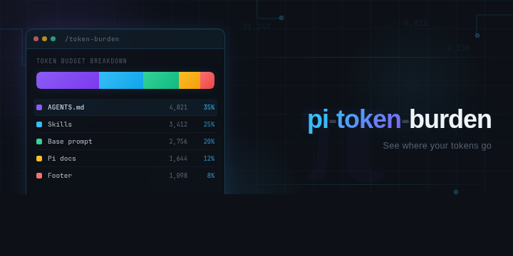
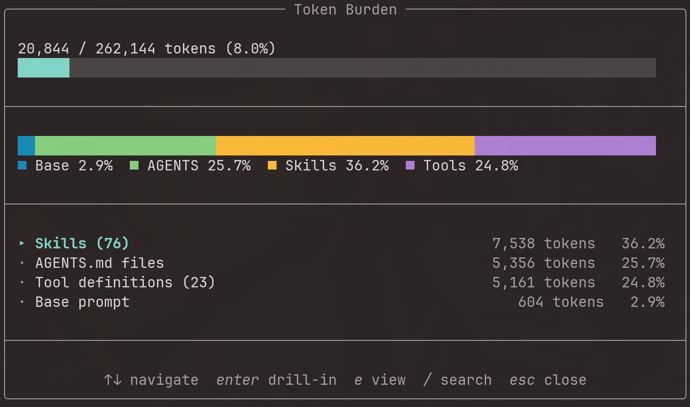

<p align="center">
  
</p>

# pi-token-burden

[](https://www.npmjs.com/package/pi-token-burden)
[](https://github.com/Whamp/pi-token-burden/actions)
[](LICENSE)

See where your system prompt tokens go.

A [pi](https://github.com/mariozechner/pi) extension that parses the assembled
system prompt and shows a token-budget breakdown by section. Run `/token-burden`
to see how much of your context window is consumed by the base prompt, AGENTS.md
files, skills, SYSTEM.md overrides, and metadata.

<p align="center">
  
</p>

## Install

```bash
pi install npm:pi-token-burden
```

Or from git:

```bash
pi install git:github.com/Whamp/pi-token-burden
```

To try it for a single session without installing, use `pi -e npm:pi-token-burden`.

### Requirements

- [pi](https://github.com/mariozechner/pi) v0.55.1 or later

## Usage

Type `/token-burden` in any pi session. An overlay appears with a stacked bar
and a drill-down table:

```
╭─────────────────────────────── Token Burden ────────────────────────────────╮
│                                                                              │
│ 9,734 / 200,000 tokens (4.9%)                                                │
│ ████░░░░░░░░░░░░░░░░░░░░░░░░░░░░░░░░░░░░░░░░░░░░░░░░░░░░░░░░░░░░░░░░░░░░░░░░ │
│                                                                              │
├──────────────────────────────────────────────────────────────────────────────┤
│                                                                              │
│ ████████████████████████████████████████████████████████████████████████████ │
│ ■ Base 4.8%  ■ AGENTS 28.9%  ■ Skills 65.9%  ■ Meta 0.3%                     │
│                                                                              │
├──────────────────────────────────────────────────────────────────────────────┤
│                                                                              │
│ ▸ Skills (59)                                           6,414 tokens   65.9% │
│ · AGENTS.md files                                       2,817 tokens   28.9% │
│ · Base prompt                                             469 tokens    4.8% │
│ · Metadata (date/time, cwd)                                33 tokens    0.3% │
│                                                                              │
├──────────────────────────────────────────────────────────────────────────────┤
│                                                                              │
│             ↑↓ navigate  enter drill-in  / search  esc close                 │
╰──────────────────────────────────────────────────────────────────────────────╯
```

The table is sorted by token count (descending). Use arrow keys to navigate,
Enter to drill down into children (e.g., individual skills or AGENTS.md files),
and `/` to fuzzy-search items.

### What each section measures

| Section                          | Content                                                          |
| -------------------------------- | ---------------------------------------------------------------- |
| **Base prompt**                  | pi's built-in instructions, tool descriptions, guidelines        |
| **SYSTEM.md / APPEND_SYSTEM.md** | Your custom system prompt overrides                              |
| **AGENTS.md files**              | Each AGENTS.md file, listed individually                         |
| **Skills**                       | The `<available_skills>` block, with per-skill breakdown         |
| **Metadata**                     | The `Current date and time` / `Current working directory` footer |

### Token estimation

Tokens are counted using [gpt-tokenizer](https://github.com/niieani/gpt-tokenizer)
with the `o200k_base` encoding (used by GPT-4o, o1, o3, and other modern models).
This gives exact BPE token counts rather than a character-based approximation.

## Development

```bash
git clone https://github.com/Whamp/pi-token-burden.git
cd pi-token-burden
pnpm install
pnpm run test     # 21 tests
pnpm run check    # lint, typecheck, format, dead code, duplicates, tests
```

Test locally: `pi -e ./src/index.ts`, then type `/token-burden`.

## Contributing

Contributions are welcome. Please open an issue before starting work on
larger changes.

## Changelog

See [CHANGELOG.md](CHANGELOG.md) for release history.

## License

[MIT](LICENSE)
